# 🔒 VPN Site-to-Site FortiGate — IPsec IKEv2

**Lisbeth Gómez · Matrícula 2025-0701**

    

> VPN Site-to-Site IPsec (IKEv2) entre dos FortiGate que comunica una red de usuarios (VLAN 10) con un servidor web HTTPS a través de un ISP. El túnel es *route-based*: Fase 1, Fase 2, rutas estáticas y políticas de firewall son cuatro piezas independientes.

---

## 🎬 Video demostrativo

> **[▶ Ver el video de la demostración](https://youtu.be/ZZCAaEpDaJs)**
>
> El video muestra: DHCP en la VLAN 10, comunicación entre el usuario y el servidor con el túnel activo (ping, traceroute y HTTPS) y la pérdida total de comunicación al deshabilitar el túnel.

---

## 📑 Tabla de Contenido

- [🎯 Propósito del laboratorio](#-propósito-del-laboratorio)
- [✅ Cumplimiento de los requisitos](#-cumplimiento-de-los-requisitos)
- [🌐 Topología](#-topología)
- [📋 Direccionamiento](#-direccionamiento)
- [🧰 Equipos y tecnologías](#-equipos-y-tecnologías)
- [🔧 Configuración](#-configuración)
- [🔐 VPN Site-to-Site](#-vpn-site-to-site)
- [🧪 Pruebas y validación](#-pruebas-y-validación)
- [📁 Estructura del repositorio](#-estructura-del-repositorio)
- [📝 Notas y buenas prácticas](#-notas-y-buenas-prácticas)
- [👤 Autor](#-autor)

---

## 🎯 Propósito del laboratorio

Comunicar una red de **usuarios** con un **servidor web HTTPS** ubicados en sedes distintas, separadas por un **ISP** que solo enruta IPs públicas. Para lograrlo se construye una **VPN IPsec Site-to-Site** entre dos firewalls **FortiGate**, de modo que el tráfico entre las redes privadas viaje cifrado a través del ISP.

**Objetivos**

1. Comunicar al usuario con el servidor a través del enlace VPN.
2. Comprobar que la comunicación **solo fluye si el enlace VPN está activo**.
3. Configurar y demostrar todo por **GUI** en los FortiGate (configuración de red, NAT y VPN Site-to-Site).

**Enunciado de la infraestructura**

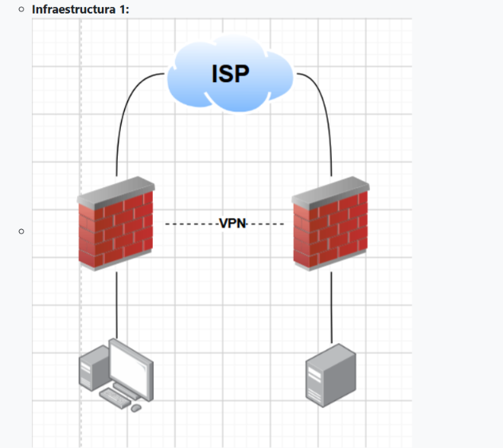

| Elemento | Requisito |
|---|---|
| 2 FortiGate | Toda configuración y demostración por GUI: redes, NAT y VPN Site-to-Site |
| ISP | IPs públicas |
| Servidor web | Red /28, HTTPS |
| Usuarios | Red /25, VLAN 10, DHCP, traceroute hacia el servidor |
| Switch | Entre los usuarios y el FortiGate del lado usuarios |

---

## ✅ Cumplimiento de los requisitos

| Requisito de la práctica | Dónde se cumple |
|---|---|
| Video demostrativo al principio | [🎬 Video demostrativo](#-video-demostrativo) |
| Propósito del laboratorio | [🎯 Propósito del laboratorio](#-propósito-del-laboratorio) |
| Documentación con imágenes | Todo este README y la carpeta [`images/`](images/) |
| Diagramas | [🌐 Topología](#-topología): diagramas Mermaid, topología de GNS3 y diagrama del enunciado |
| Scripts utilizados | [`files/scripts/`](files/scripts/) |
| Running-configs | [`files/running-configs/`](files/running-configs/) |
| Usuarios `/25`, VLAN 10, DHCP y traceroute | [Configuración](#-configuración) y [Pruebas](#-pruebas-y-validación) |
| Servidor web `/28` con HTTPS | [Servidor web](#53-servidor-web) |
| ISP con IPs públicas | [Direccionamiento](#-direccionamiento) |
| Configuración de red y NAT en los FortiGate por GUI | [FortiGate-1](#55-fortigate-1-por-gui) y [FortiGate-2](#56-fortigate-2-por-gui) |
| VPN Site-to-Site entre los FortiGate | [🔐 VPN Site-to-Site](#-vpn-site-to-site) |
| Comunicación usuario ↔ servidor por la VPN | [Prueba 1](#71-prueba-1-comunicación-con-el-túnel-activo) |
| La comunicación solo fluye si la VPN está activa | [Prueba 2](#72-prueba-2-la-comunicación-solo-fluye-si-la-vpn-está-activa) |

---

## 🌐 Topología

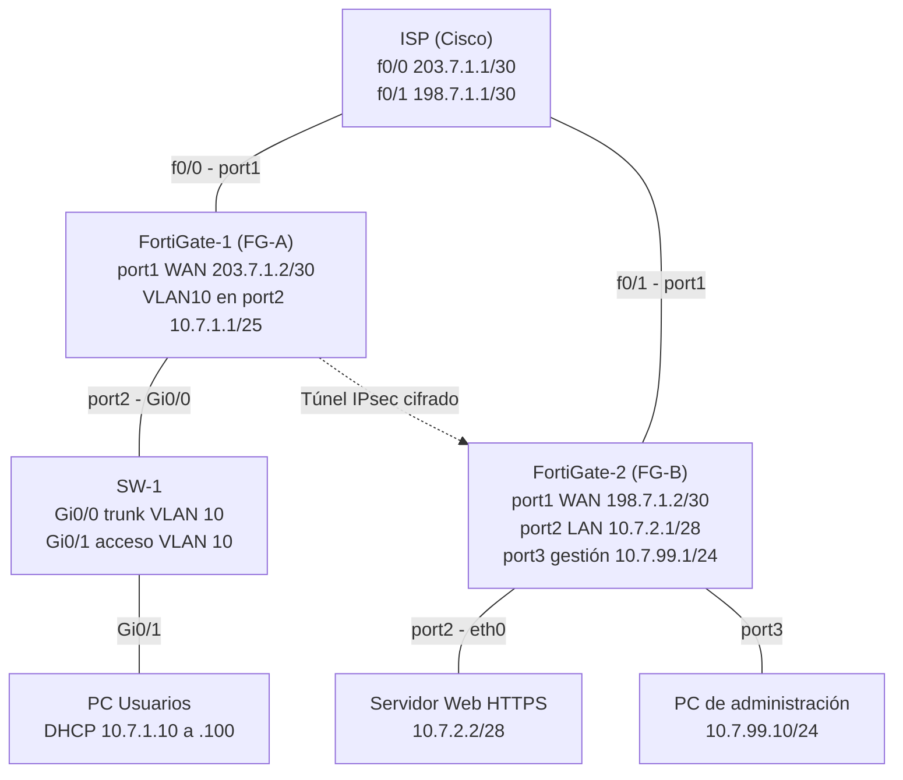

**Topología en GNS3**


  

**Flujo del tráfico entre el usuario y el servidor**

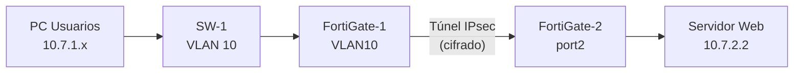

Sin el túnel no existe ruta válida hacia `10.7.2.0/28`: solo queda la ruta *blackhole*, que descarta el tráfico, y el ISP no conoce las redes privadas.

### Conexiones físicas

| Equipo | Puerto | Va a |
|---|---|---|
| FG-1 | port1 | ISP f0/0 |
| FG-1 | port2 | SW-1 Gi0/0 |
| SW-1 | Gi0/1 | PC de usuarios |
| FG-2 | port1 | ISP f0/1 |
| FG-2 | port2 | Servidor (eth0) |
| FG-2 | port3 | PC 2 de administración (WS0701-1) |

---

## 📋 Direccionamiento

### Redes

| Segmento | Red | Detalle |
|---|---|---|
| Usuarios (VLAN 10) | `10.7.1.0/25` | GW FG-1: `.1`, DHCP: `.10` a `.100` |
| Servidor | `10.7.2.0/28` | GW FG-2: `.1`, servidor: `.2` |
| FG-1 ↔ ISP | `203.7.1.0/30` | ISP `.1`, FG-1 `.2` |
| FG-2 ↔ ISP | `198.7.1.0/30` | ISP `.1`, FG-2 `.2` |
| Administración FG-2 | `10.7.99.0/24` | FG-2 `.1`, PC 2 `.10` (no entra en la VPN) |

### Direcciones por dispositivo

| Dispositivo | Interfaz | Conecta con | Dirección IP |
|---|---|---|---|
| **ISP** | f0/0 | FortiGate-1 (port1) | `203.7.1.1/30` |
| **ISP** | f0/1 | FortiGate-2 (port1) | `198.7.1.1/30` |
| **FortiGate-1 (FG-A)** | port1 (WAN) | ISP f0/0 | `203.7.1.2/30` |
| **FortiGate-1 (FG-A)** | port2 → VLAN10 | SW-1 Gi0/0 | `10.7.1.1/25` (gateway de usuarios, DHCP) |
| **SW-1** | Gi0/0 | FortiGate-1 port2 | Trunk VLAN 10 (sin IP) |
| **SW-1** | Gi0/1 | PC de usuarios | Acceso VLAN 10 (sin IP) |
| **PC de usuarios** | e0 | SW-1 Gi0/1 | DHCP `10.7.1.10-.100`, máscara `255.255.255.128`, gateway `10.7.1.1` |
| **FortiGate-2 (FG-B)** | port1 (WAN) | ISP f0/1 | `198.7.1.2/30` |
| **FortiGate-2 (FG-B)** | port2 (LAN) | Servidor eth0 | `10.7.2.1/28` |
| **FortiGate-2 (FG-B)** | port3 (gestión) | PC 2 | `10.7.99.1/24` |
| **Servidor web** | eth0 | FortiGate-2 port2 | `10.7.2.2/28`, gateway `10.7.2.1` |
| **PC 2 (administración)** | e0 | FortiGate-2 port3 | `10.7.99.10/24`, gateway `10.7.99.1` |

---

## 🧰 Equipos y tecnologías

| Componente | Tecnología |
|---|---|
| Firewalls | FortiGate-VM v7.0.9 (licencia de evaluación), configurados por GUI |
| Switch | Cisco IOSvL2 |
| Router ISP | Cisco IOS |
| Servidor web | Contenedor Docker en GNS3 con Apache2 (HTTP 80 y HTTPS 443) |
| Emulador | GNS3 |
| VPN | IPsec route-based, IKEv2, clave precompartida (PSK) |
| Acceso a equipos Cisco | SSH versión 2 con usuario local `Admin` (credenciales de laboratorio) |

---

## 🔧 Configuración

El orden de trabajo va de abajo hacia arriba: primero enlaces, IPs y rutas, y al final la VPN. Así, si algo falla, se sabe si el problema es de la red base o del túnel.

### 5.1 ISP (router Cisco)

Script completo: [`files/scripts/03-isp-router.txt`](files/scripts/03-isp-router.txt)

```
enable
configure terminal
no ip domain-lookup
hostname ISP
banner motd #Lisbeth Gómez 2025-0701#
username Admin privilege 15 secret cisco
enable secret cisco
line console 0
login local
exit
ip domain-name red.local
crypto key generate rsa
2048
ip ssh version 2
line vty 0 4
login local
transport input ssh
exit
end
write memory

configure terminal
interface f0/0
 ip address 203.7.1.1 255.255.255.252
 no shutdown
interface f0/1
 ip address 198.7.1.1 255.255.255.252
 no shutdown
end
write memory
```

**Por qué así:** cada FortiGate necesita su propio enlace con el ISP y por eso son dos interfaces separadas. Se usan redes /30 porque un enlace punto a punto solo necesita 2 IPs útiles. El ISP **no conoce** las redes privadas `10.7.x.x`, y eso obliga a que la comunicación entre ellas solo pueda ir por la VPN.


### 5.2 Switch SW-1

Script completo: [`files/scripts/02-switch-sw1.txt`](files/scripts/02-switch-sw1.txt)

```
enable
configure terminal
no ip domain-lookup
hostname SW-1
banner motd #Lisbeth Gómez 2025-0701#
username Admin privilege 15 secret cisco
enable secret cisco
line console 0
login local
exit
ip domain-name red.local
crypto key generate rsa
2048
ip ssh version 2
line vty 0 4
login local
transport input ssh
exit
end
write memory

configure terminal
vlan 10
 name USUARIOS
exit
interface g0/0
 description HACIA-FORTIGATE-1-PORT2
 switchport trunk encapsulation dot1q
 switchport mode trunk
 switchport trunk allowed vlan 10
 no shutdown
interface g0/1
 description HACIA-PC-WINDOWS
 switchport mode access
 switchport access vlan 10
 no shutdown
end
write memory
```

**Por qué así:** `Gi0/0` va en **trunk** con la VLAN 10 permitida porque hacia el FortiGate viaja tráfico etiquetado. `Gi0/1` va en **acceso** a la VLAN 10 porque la PC no etiqueta.


### 5.3 Servidor web

Script completo: [`files/scripts/01-servidor-web.txt`](files/scripts/01-servidor-web.txt)

Configuración persistente (*Configure > Network configuration > Edit* del nodo en GNS3, sin comentarios `#`):

```
auto eth0
iface eth0 inet static
 address 10.7.2.2
 netmask 255.255.255.240
 gateway 10.7.2.1
```

Aplicación manual desde la consola del servidor (no persiste al reiniciar el nodo):

```
ip addr show eth0
ip addr flush dev eth0
ip addr add 10.7.2.2/28 dev eth0
ip route del default 2>/dev/null
ip route add default via 10.7.2.1
ip addr show eth0
ping -c 3 10.7.2.1
```

El servidor ejecuta **Apache2** escuchando en los puertos **80 y 443** (HTTPS con certificado autofirmado) y sirve una página de identificación:

```
echo "<h1>Servidor Web del laboratorio - 10.7.2.2</h1>" > /var/www/html/index.html
```

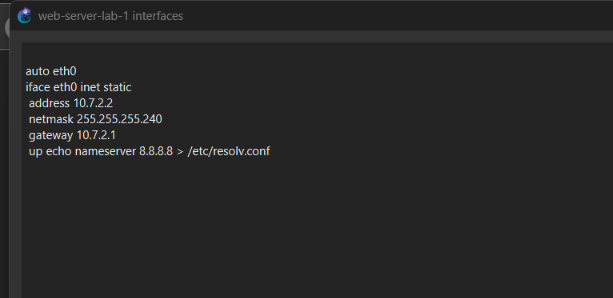


### 5.4 Acceso inicial a los FortiGate (consola)

Solo la mínima configuración por consola para poder entrar a la GUI. **Todo lo demás se configura por GUI.**

**FortiGate-1** — interfaz VLAN10 sobre el port2 (donde está conectado el switch):
[`files/scripts/04-fortigate-1-acceso-inicial.cli`](files/scripts/04-fortigate-1-acceso-inicial.cli)

```
config system interface
 edit "VLAN10"
  set vdom "root"
  set type vlan
  set interface "port2"
  set vlanid 10
  set ip 10.7.1.1 255.255.255.128
  set allowaccess ping https http ssh
  set role lan
 next
end
```

**FortiGate-2** — red de administración en port3:
[`files/scripts/05-fortigate-2-acceso-inicial.cli`](files/scripts/05-fortigate-2-acceso-inicial.cli)

```
config system interface
 edit "port3"
  set mode static
  set ip 10.7.99.1 255.255.255.0
  set allowaccess ping https http ssh
 next
end
```

**PC 2 (Windows)** — IP fija para entrar a la GUI del FortiGate-2:

| Campo | Valor |
|---|---|
| IP | `10.7.99.10` |
| Máscara | `255.255.255.0` |
| Gateway | `10.7.99.1` |

Acceso a las GUI: FortiGate-1 en `http://10.7.1.1` (desde la PC de usuarios) y FortiGate-2 en `http://10.7.99.1` (desde la PC 2).


### 5.5 FortiGate-1 por GUI

| Paso | Ruta en la GUI | Valor |
|---|---|---|
| WAN | Network > Interfaces > port1 | Manual, `203.7.1.2/255.255.255.252`, role WAN, solo PING |
| Ruta por defecto | Network > Static Routes | `0.0.0.0/0` → `203.7.1.1` por port1 |
| DHCP | Network > Interfaces > VLAN10 | Rango `10.7.1.10-10.7.1.100`, gateway = IP de la interfaz |
| Salida a Internet | Policy & Objects > Firewall Policy | `LAN-to-WAN`: VLAN10 → port1, **NAT activado** |

**Por qué cada paso**

- **WAN con IP fija:** el ISP no entrega IPs; necesita una dentro del /30 del enlace. Solo PING para no exponer la GUI hacia fuera.
- **Ruta por defecto:** todo lo que el FortiGate no conozca sale hacia el ISP. Sin ella no alcanza la WAN del otro FortiGate y la VPN no negocia.
- **DHCP en la VLAN 10:** la PC recibe IP, máscara y gateway automáticamente. El rango empieza en `.10` para dejar libre el `.1` del FortiGate.
- **NAT:** las IPs `10.7.x.x` son privadas y el ISP no sabría devolver las respuestas; el NAT cambia el origen a la IP pública del FortiGate.

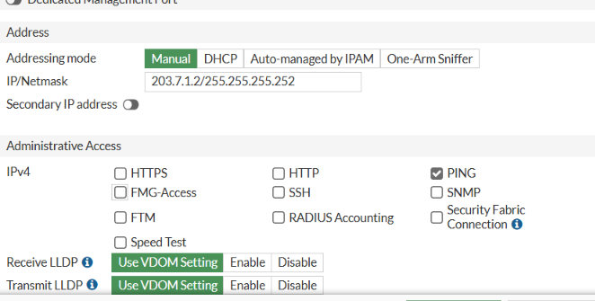
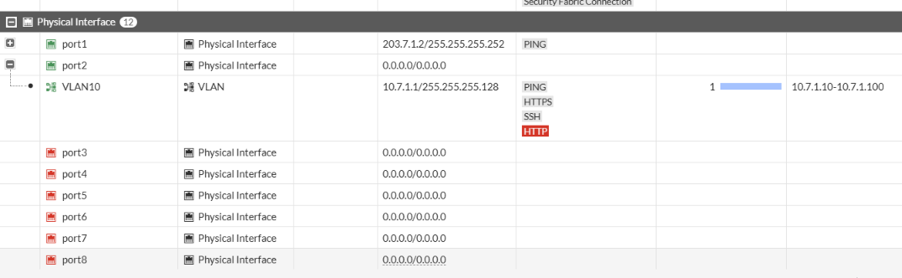


### 5.6 FortiGate-2 por GUI

| Paso | Ruta en la GUI | Valor |
|---|---|---|
| WAN | Network > Interfaces > port1 | Manual, `198.7.1.2/255.255.255.252`, role WAN, solo PING |
| Ruta por defecto | Network > Static Routes | `0.0.0.0/0` → `198.7.1.1` por port1 |
| LAN del servidor | Network > Interfaces > port2 | Manual, `10.7.2.1/255.255.255.240`, role LAN, sin DHCP |
| Salida a Internet | Policy & Objects > Firewall Policy | `LAN-to-WAN`: port2 → port1, **NAT activado** |

El port3 (administración) se mantiene fuera de la VPN.


### 5.7 Verificación previa a la VPN

| Prueba | Dónde | Resultado esperado |
|---|---|---|
| `ipconfig` | PC de usuarios | IP `10.7.1.10-.100` por DHCP, gateway `10.7.1.1` |
| `ping 10.7.1.1` | PC de usuarios | Responde |
| `execute ping 203.7.1.1` | FortiGate-1 | Responde (ISP) |
| `execute ping 198.7.1.1` | FortiGate-2 | Responde (ISP) |
| `execute ping 10.7.2.2` | FortiGate-2 | Responde (servidor) |
| `execute ping 198.7.1.2` | FortiGate-1 | Responde (las WAN se ven entre sí) |

---

## 🔐 VPN Site-to-Site

Se usa un túnel **personalizado (Custom)**: `VPN > IPsec Tunnels > Create New > Custom`. Se prefirió sobre el asistente *Site to Site* para poder elegir los parámetros de seguridad en lugar de aceptar los de por defecto. Los parámetros de seguridad deben ser **idénticos en ambos FortiGate**.

### 6.1 Parámetros del túnel

| Parámetro | FortiGate-1 | FortiGate-2 |
|---|---|---|
| Nombre | `VPN-FG1-FG2` | `VPN-FG2-FG1` |
| Remote Gateway | Static IP `198.7.1.2` | Static IP `203.7.1.2` |
| Interface | port1 | port1 |
| NAT Traversal / DPD | Enable / On Demand | Enable / On Demand |
| Autenticación | Pre-shared Key (`<PSK>`) | Pre-shared Key (`<PSK>`) |
| Versión de IKE | **2** | **2** |
| Fase 1: cifrado y autenticación | **DES + SHA256** | **DES + SHA256** |
| Fase 1: grupo Diffie-Hellman | **14** | **14** |
| Fase 1: tiempo de vida | 86400 s | 86400 s |
| Fase 2: nombre | `FG1-FG2-P2` | `FG2-FG1-P2` |
| Fase 2: dirección local | `10.7.1.0/255.255.255.128` | `10.7.2.0/255.255.255.240` |
| Fase 2: dirección remota | `10.7.2.0/255.255.255.240` | `10.7.1.0/255.255.255.128` |
| Fase 2: cifrado y autenticación | **DES + SHA256** | **DES + SHA256** |
| Fase 2: PFS | Activado, DH **14** | Activado, DH **14** |
| Fase 2: Replay Detection | Activado | Activado |
| Fase 2: tiempo de vida | 43200 s | 43200 s |

**Por qué cada parámetro**

- **IKEv2:** versión más moderna y eficiente de la negociación.
- **SHA256:** autenticación más fuerte que MD5.
- **DH 14 y PFS:** cada sesión genera claves nuevas que no dependen de las anteriores.
- **Selectores de Fase 2 espejo:** definen qué tráfico entra al túnel. Si no coinciden exactamente en ambos lados, la Fase 2 no negocia.

> **Nota sobre el cifrado:** en este entorno el FortiGate-VM (licencia de evaluación) solo ofrece **DES** en el desplegable de cifrado. Se eligió la combinación más fuerte disponible: autenticación **SHA256** (en lugar de MD5), **IKEv2**, **DH 14** y **PFS**. En producción se usaría **AES256** con SHA256 (o AES256-GCM) y DH 14 o superior.

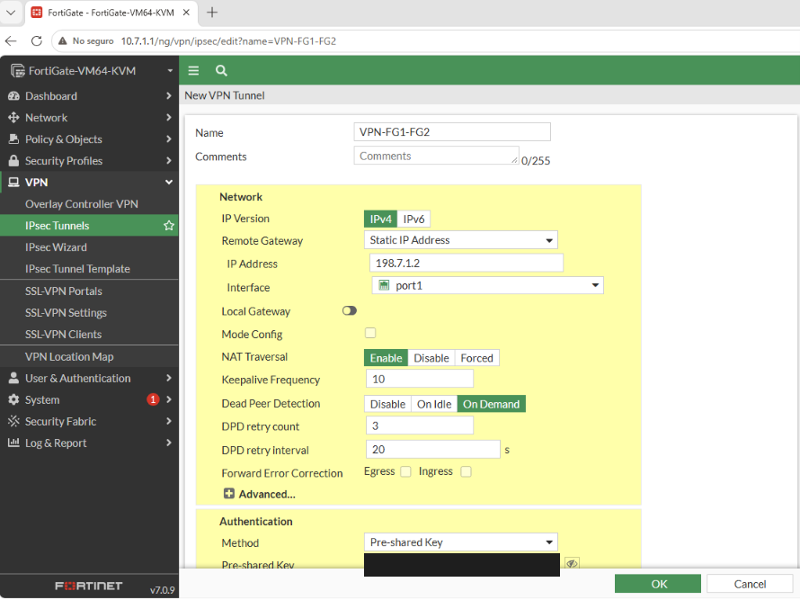
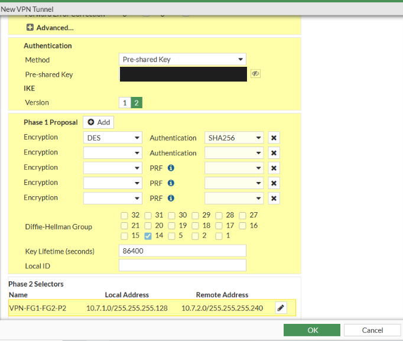
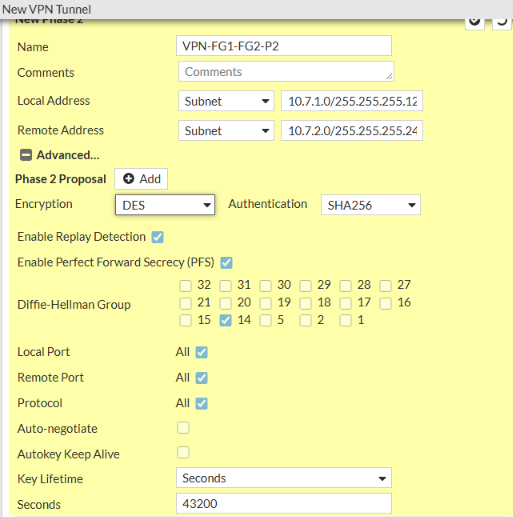


### 6.2 Objetos de dirección

`Policy & Objects > Addresses`:

| Objeto | FortiGate-1 | FortiGate-2 |
|---|---|---|
| `VPN-LOCAL` | `10.7.1.0/255.255.255.128` | `10.7.2.0/255.255.255.240` |
| `VPN-REMOTE` | `10.7.2.0/255.255.255.240` | `10.7.1.0/255.255.255.128` |

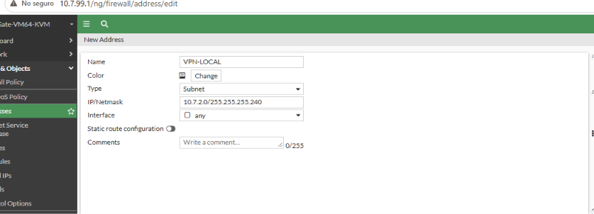


### 6.3 Rutas estáticas

`Network > Static Routes`, dos rutas hacia la red remota en cada FortiGate:

| Ruta | Destino (FG-1) | Destino (FG-2) | Interface | Distancia |
|---|---|---|---|---|
| Por el túnel | `10.7.2.0/255.255.255.240` | `10.7.1.0/255.255.255.128` | el túnel (`VPN-FG1-FG2` / `VPN-FG2-FG1`) | 10 |
| Blackhole | `10.7.2.0/255.255.255.240` | `10.7.1.0/255.255.255.128` | Blackhole | 254 |

**Por qué dos rutas:** con el túnel activo gana la de distancia 10. Si el túnel cae, esa ruta desaparece y queda la *blackhole*, que **descarta** el tráfico en lugar de mandarlo al ISP. Eso garantiza que la comunicación solo fluye con la VPN activa.

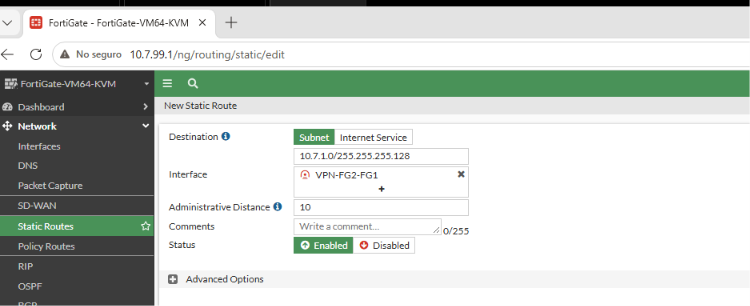


### 6.4 Políticas de firewall

`Policy & Objects > Firewall Policy`, dos políticas por FortiGate, ambas con **NAT desactivado**, Service `ALL`, Action `ACCEPT` y Schedule `always`:

| Política | FortiGate-1 | FortiGate-2 |
|---|---|---|
| `LAN-to-VPN` | `VLAN10` → `VPN-FG1-FG2`, origen `VPN-LOCAL`, destino `VPN-REMOTE` | `port2` → `VPN-FG2-FG1`, origen `VPN-LOCAL`, destino `VPN-REMOTE` |
| `VPN-to-LAN` | `VPN-FG1-FG2` → `VLAN10`, origen `VPN-REMOTE`, destino `VPN-LOCAL` | `VPN-FG2-FG1` → `port2`, origen `VPN-REMOTE`, destino `VPN-LOCAL` |

**Por qué NAT desactivado:** dentro del túnel el tráfico debe conservar sus IPs privadas reales, que son las de los selectores de la Fase 2.


### 6.5 Comparativa: asistente vs. túnel Custom

Primero se configuró la VPN con el asistente *Site to Site* y luego se rehízo como túnel Custom para controlar los parámetros.

| | Asistente (primer intento) | Túnel Custom (final) |
|---|---|---|
| Versión de IKE | 1 | **2** |
| Propuesta negociada | `des-md5` | **`des-sha256`** |
| Grupo DH / PFS | Por defecto | **DH 14 con PFS** |
| Rutas y políticas | Creadas automáticamente | Creadas a mano |
| Control de parámetros | Limitado | Total |

Evidencia del primer intento con el asistente (rutas y políticas generadas automáticamente en el FortiGate-2):

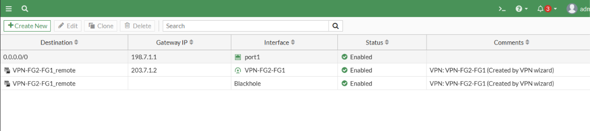
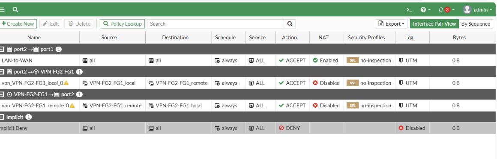

---

## 🧪 Pruebas y validación

### 7.0 Estado del túnel

```
diagnose vpn ike gateway list
diagnose vpn tunnel list
```

Resultado observado con el túnel Custom:

- **IKE versión 2**, `proposal: des-sha256`
- **Fase 1:** `IKE SA: established`
- **Fase 2:** `IPsec SA: established`, con `esp=des` y `ah=sha256`
- **Selectores:** origen `10.7.1.0-10.7.1.127`, destino `10.7.2.0-10.7.2.15`
- **Tráfico cifrado:** contadores `enc` y `dec` en aumento al generar tráfico


### 7.1 Prueba 1: comunicación con el túnel activo

Desde la PC de usuarios:

```
ping 10.7.2.2
tracert 10.7.2.2
https://10.7.2.2
```

(la URL se abre en el navegador; se acepta la advertencia del certificado autofirmado).

**Resultado:** el ping responde desde `10.7.2.2`, el traceroute sale por `10.7.1.1` y llega a `10.7.2.2` **sin mostrar al ISP** (el tráfico viaja encapsulado en el túnel), y el navegador muestra la página del servidor.


### 7.2 Prueba 2: la comunicación solo fluye si la VPN está activa

1. En la PC de usuarios: `ping -t 10.7.2.2` (ping continuo).
2. En el FortiGate-1: `Network > Interfaces`, desplegar port1, editar `VPN-FG1-FG2` y poner **Status: Disabled**.
3. Repetir `ping -t 10.7.2.2`, `tracert 10.7.2.2` y el HTTPS.
4. Prueba de control, con el túnel todavía deshabilitado: `ping 10.7.1.1` y `ping 203.7.1.1`.
5. Reactivar el túnel (**Status: Enabled**) y comprobar que la comunicación se recupera.

**Resultado:**

- Con el túnel deshabilitado, `ping`, `tracert` y HTTPS al servidor **fallan**.
- `ping 10.7.1.1` y `ping 203.7.1.1` **siguen respondiendo**: la red base está sana y la VPN es el único camino hacia el servidor.
- En el FortiGate, `diagnose vpn tunnel list` pasa de `accept_traffic=1`, `sa=1` y contadores en aumento (túnel activo) a `accept_traffic=0`, `sa=0` y contadores en cero (túnel deshabilitado).
- Al reactivarlo, el tráfico vuelve a pasar y el ping continuo se recupera.

Con el túnel deshabilitado desaparece la ruta hacia `10.7.2.0/28`, la ruta *blackhole* descarta el tráfico y el ISP no conoce esas redes privadas.

> Se deshabilita la interfaz del túnel y no se usa "Bring Down", porque este último solo tumba la sesión y el siguiente paquete la vuelve a negociar.

| Con el túnel activo | Con el túnel deshabilitado |
|---|---|
| `accept_traffic=1` | `accept_traffic=0` |
| `sa=1` | `sa=0` |
| Contadores `enc/dec` en aumento | Contadores en cero |
| `ping`, `tracert` y HTTPS al servidor funcionan | `ping`, `tracert` y HTTPS al servidor fallan |
| — | `ping 10.7.1.1` y `ping 203.7.1.1` siguen respondiendo |


---

### Herramientas de diagnóstico utilizadas

Lista completa: [`files/scripts/07-comandos-diagnostico.txt`](files/scripts/07-comandos-diagnostico.txt)

- `diagnose sniffer packet <interfaz> "arp or icmp" 4`: permitió ver que el servidor preguntaba por el gateway viejo.
- `get system interface physical`: reveló qué puerto tenía enlace realmente.
- `diagnose vpn ike gateway list` y `diagnose vpn tunnel list`: estado de la Fase 1, la Fase 2 y los contadores cifrados.

---

## 📁 Estructura del repositorio

```
.
├── README.md                    # Video, propósito, topología, configuración y pruebas
├── images/                      # Capturas de pantalla (evidencias)
│   ├── 01-topologia/
│   ├── 02-isp-switch/
│   ├── 03-fortigate-1/
│   ├── 04-fortigate-2/
│   ├── 05-servidor-web/
│   ├── 06-vpn/
│   ├── 07-pruebas/
│   ├── 08-troubleshooting/
│   └── 09-intento-asistente/
└── files/
    ├── scripts/                 # Scripts y comandos utilizados
    └── running-configs/         # Configuraciones en ejecución de cada equipo
```

| Carpeta | Contenido |
|---|---|
| [`files/scripts/`](files/scripts/) | Servidor web, switch, ISP, acceso inicial de cada FortiGate, PCs y pruebas, comandos de diagnóstico |
| [`files/running-configs/`](files/running-configs/) | Running-config del ISP, del switch y de los dos FortiGate |
| [`images/`](images/) | Capturas ordenadas por sección (ver [`images/README.md`](images/README.md)) |

---

## 📝 Notas y buenas prácticas

- La licencia de evaluación de los FortiGate vence el **13 de octubre de 2026**.
- La clave precompartida (PSK) **no se publica** en este repositorio; en las configuraciones se sustituye por `<PSK>`.
- Las capturas de `diagnose vpn tunnel list` se recortan para no mostrar claves de sesión (`key=`).
- Las credenciales de los equipos Cisco (`Admin` / `cisco`) son de laboratorio y no deben reutilizarse.
- Los equipos Cisco se administran por **SSH versión 2** y el acceso por consola exige usuario local.
- Se apagan los FortiGate con `execute shutdown` antes de detener el nodo en GNS3, para evitar daños en el disco.
- Al terminar la práctica se retira `http` del acceso administrativo de las interfaces de los FortiGate.

---

## 👤 Autor

**Lisbeth Gómez** · Matrícula **2025-0701**

Laboratorio: VPN Site-to-Site IPsec con FortiGate · Octubre de 2026
