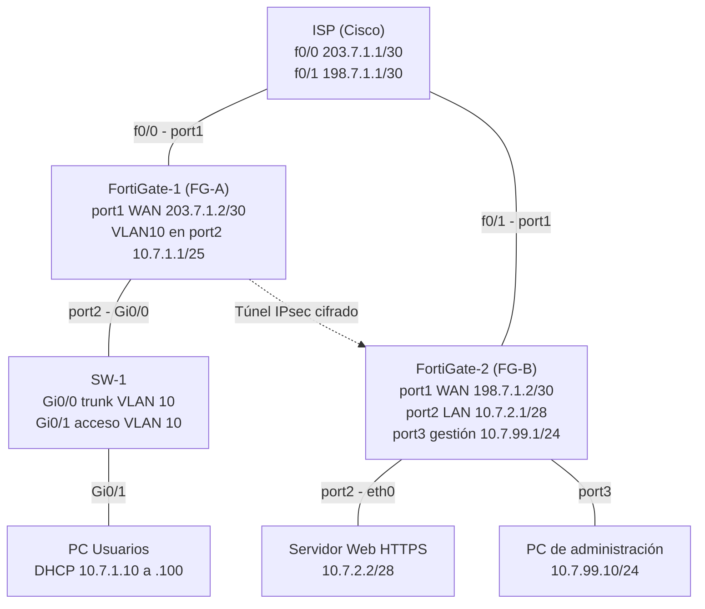
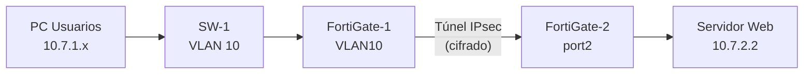

# Laboratorio: VPN Site-to-Site IPsec con FortiGate

## 🎬 Video demostrativo

> **[▶ Ver el video de la demostración](REEMPLAZAR_CON_URL_DEL_VIDEO)**
>
> El video muestra: DHCP en la VLAN 10, comunicación entre el usuario y el servidor con el túnel activo (ping, traceroute y HTTPS) y la pérdida total de comunicación al deshabilitar el túnel.

---

## 1. Propósito del laboratorio

Comunicar una red de **usuarios** con un **servidor web HTTPS** ubicados en sedes distintas, separadas por un **ISP** que solo enruta IPs públicas. Para lograrlo se construye una **VPN IPsec Site-to-Site** entre dos firewalls **FortiGate**, de modo que el tráfico entre las redes privadas viaje cifrado por el ISP.

**Objetivos**

1. Comunicar al usuario con el servidor a través del enlace VPN.
2. Comprobar que la comunicación **solo fluye si el enlace VPN está activo**.
3. Configurar y demostrar todo por **GUI** en los FortiGate (redes, NAT y VPN).

**Requisitos del laboratorio**

| Elemento | Requisito |
|---|---|
| FortiGate (x2) | Configuración por GUI: redes, NAT y VPN Site-to-Site |
| ISP | IPs públicas |
| Servidor web | Red /28, HTTPS |
| Usuarios | Red /25, VLAN 10, DHCP, traceroute hacia el servidor |
| Switch | Entre los usuarios y el FortiGate del lado usuarios |

---

## 2. Topología




### Flujo del tráfico



Sin el túnel no existe ruta válida hacia `10.7.2.0/28`: solo queda la ruta *blackhole*, que descarta el tráfico, y el ISP no conoce las redes privadas.

---

## 3. Direccionamiento por dispositivo

| Dispositivo | Interfaz | Conecta con | Dirección IP |
|---|---|---|---|
| **ISP** | f0/0 | FortiGate-1 (port1) | `203.7.1.1/30` |
| **ISP** | f0/1 | FortiGate-2 (port1) | `198.7.1.1/30` |
| **FortiGate-1 (FG-A)** | port1 (WAN) | ISP f0/0 | `203.7.1.2/30` |
| **FortiGate-1 (FG-A)** | port2 → VLAN10 | SW-1 Gi0/0 | `10.7.1.1/25` (gateway de usuarios, DHCP) |
| **SW-1** | Gi0/0 | FortiGate-1 port2 | Trunk VLAN 10 (sin IP) |
| **SW-1** | Gi0/1 | PC de usuarios | Acceso VLAN 10 (sin IP) |
| **PC de usuarios** | e0 | SW-1 Gi0/1 | DHCP `10.7.1.10` a `10.7.1.100`, máscara `255.255.255.128`, gateway `10.7.1.1` |
| **FortiGate-2 (FG-B)** | port1 (WAN) | ISP f0/1 | `198.7.1.2/30` |
| **FortiGate-2 (FG-B)** | port2 (LAN) | Servidor eth0 | `10.7.2.1/28` (gateway del servidor) |
| **FortiGate-2 (FG-B)** | port3 (gestión) | PC de administración | `10.7.99.1/24` |
| **Servidor web** | eth0 | FortiGate-2 port2 | `10.7.2.2/28`, gateway `10.7.2.1` |
| **PC de administración** | e0 | FortiGate-2 port3 | `10.7.99.10/24`, gateway `10.7.99.1` |

### Redes

| Segmento | Red |
|---|---|
| Enlace ISP ↔ FortiGate-1 | `203.7.1.0/30` |
| Enlace ISP ↔ FortiGate-2 | `198.7.1.0/30` |
| Usuarios (VLAN 10) | `10.7.1.0/25` |
| Servidor web | `10.7.2.0/28` |
| Administración FortiGate-2 (fuera de la VPN) | `10.7.99.0/24` |

---

## 4. Tecnologías

- **FortiGate-VM** v7.0.9 (licencia de evaluación), configurado por GUI.
- **Cisco IOSvL2** (switch) y **Cisco IOS** (router ISP).
- **GNS3** para la topología; servidor web en contenedor Docker con **Apache2** (HTTP 80 y HTTPS 443).
- **IPsec** con túnel **personalizado (Custom)**, IKEv2 y clave precompartida (PSK).

---

## 5. Configuración

El orden de trabajo va de abajo hacia arriba: primero enlaces, IPs y rutas, y al final la VPN. Así, si algo falla, se sabe si el problema es de la red base o del túnel.

### 5.1 ISP (router Cisco)

```
enable
configure terminal
interface f0/0
 ip address 203.7.1.1 255.255.255.252
 no shutdown
interface f0/1
 ip address 198.7.1.1 255.255.255.252
 no shutdown
end
write memory
show ip interface brief
```

El ISP **no conoce** las redes privadas `10.7.x.x`: eso obliga a que la comunicación entre ellas solo pueda ir por la VPN.

### 5.2 Switch SW-1

```
enable
configure terminal
vlan 10
 name USUARIOS
exit
interface g0/0
 description HACIA-FORTIGATE-1
 switchport trunk encapsulation dot1q
 switchport mode trunk
 switchport trunk allowed vlan 10
 no shutdown
interface g0/1
 description HACIA-PC-WINDOWS
 switchport mode access
 switchport access vlan 10
 no shutdown
end
write memory
```

Verificación:

```
show vlan brief
show interfaces status
show interfaces trunk
show mac address-table
```


### 5.3 Servidor web (contenedor Docker en GNS3)

En *Configure > Network configuration > Edit*, sin comentarios `#`:

```
auto eth0
iface eth0 inet static
 address 10.7.2.2
 netmask 255.255.255.240
 gateway 10.7.2.1
```

Aplicación manual desde la consola (no persiste al reiniciar el nodo):

```
ip addr flush dev eth0
ip addr add 10.7.2.2/28 dev eth0
ip link set eth0 up
ip route add default via 10.7.2.1
echo "<h1>Servidor Web del laboratorio - 10.7.2.2</h1>" > /var/www/html/index.html
```

Apache2 escucha en los puertos 80 y 443 (comprobado con `netstat -tln`).

### 5.4 Acceso inicial a los FortiGate (consola)

Solo la mínima configuración por consola para poder entrar a la GUI; **todo lo demás se hace por GUI**.

**FortiGate-1** (interfaz VLAN10 sobre port2):

```
config system interface
 edit "VLAN10"
  set vdom "root"
  set type vlan
  set interface "port2"
  set vlanid 10
  set ip 10.7.1.1 255.255.255.128
  set allowaccess ping https http ssh
  set role lan
 next
end
```

**FortiGate-2** (red de administración en port3):

```
config system interface
 edit "port3"
  set mode static
  set ip 10.7.99.1 255.255.255.0
  set allowaccess ping https http ssh
 next
end
```

### 5.5 FortiGate-1 por GUI

| Paso | Ruta en la GUI | Valor |
|---|---|---|
| WAN | Network > Interfaces > port1 | Manual, `203.7.1.2/255.255.255.252`, role WAN, solo PING |
| Ruta por defecto | Network > Static Routes | `0.0.0.0/0` → `203.7.1.1` por port1 |
| DHCP | Network > Interfaces > VLAN10 | Rango `10.7.1.10-10.7.1.100`, gateway = IP de la interfaz |
| Salida a Internet | Policy & Objects > Firewall Policy | `LAN-to-WAN`: VLAN10 → port1, **NAT activado** |

**Por qué NAT:** las IPs `10.7.x.x` son privadas y el ISP no sabría devolver las respuestas; el NAT cambia el origen a la IP pública del FortiGate.


### 5.6 FortiGate-2 por GUI

| Paso | Ruta en la GUI | Valor |
|---|---|---|
| WAN | Network > Interfaces > port1 | Manual, `198.7.1.2/255.255.255.252`, role WAN, solo PING |
| Ruta por defecto | Network > Static Routes | `0.0.0.0/0` → `198.7.1.1` por port1 |
| LAN del servidor | Network > Interfaces > port2 | Manual, `10.7.2.1/255.255.255.240`, role LAN, sin DHCP |
| Salida a Internet | Policy & Objects > Firewall Policy | `LAN-to-WAN`: port2 → port1, **NAT activado** |


### 5.7 Verificación previa a la VPN

| Prueba | Dónde | Resultado esperado |
|---|---|---|
| `ipconfig` | PC de usuarios | IP `10.7.1.10-.100` por DHCP, gateway `10.7.1.1` |
| `ping 10.7.1.1` | PC de usuarios | Responde |
| `execute ping 203.7.1.1` | FortiGate-1 | Responde (ISP) |
| `execute ping 198.7.1.1` | FortiGate-2 | Responde (ISP) |
| `execute ping 10.7.2.2` | FortiGate-2 | Responde (servidor) |
| `execute ping 198.7.1.2` | FortiGate-1 | Responde (las WAN se ven entre sí) |


---

## 6. VPN Site-to-Site (túnel Custom)

Se usa un túnel **personalizado** (`VPN > IPsec Tunnels > Create New > Custom`) en lugar del asistente *Site to Site*, para poder elegir los parámetros de seguridad. Los parámetros de seguridad deben ser **idénticos en ambos FortiGate**.

### 6.1 Parámetros del túnel

| Parámetro | FortiGate-1 | FortiGate-2 |
|---|---|---|
| Nombre | `VPN-FG1-FG2` | `VPN-FG2-FG1` |
| Remote Gateway | Static IP `198.7.1.2` | Static IP `203.7.1.2` |
| Interface | port1 | port1 |
| NAT Traversal / DPD | Enable / On Demand | Enable / On Demand |
| Autenticación | Pre-shared Key (`<PSK>`) | Pre-shared Key (`<PSK>`) |
| Versión de IKE | **2** | **2** |
| Fase 1: cifrado y autenticación | **DES + SHA256** | **DES + SHA256** |
| Fase 1: grupo Diffie-Hellman | **14** | **14** |
| Fase 1: tiempo de vida | 86400 s | 86400 s |
| Fase 2: nombre | `FG1-FG2-P2` | `FG2-FG1-P2` |
| Fase 2: dirección local | `10.7.1.0/255.255.255.128` | `10.7.2.0/255.255.255.240` |
| Fase 2: dirección remota | `10.7.2.0/255.255.255.240` | `10.7.1.0/255.255.255.128` |
| Fase 2: cifrado y autenticación | **DES + SHA256** | **DES + SHA256** |
| Fase 2: PFS | Activado, DH **14** | Activado, DH **14** |
| Fase 2: Replay Detection | Activado | Activado |
| Fase 2: tiempo de vida | 43200 s | 43200 s |

> **Nota sobre el cifrado:** en este entorno el FortiGate-VM (licencia de evaluación) solo ofrece **DES** en el desplegable de cifrado. Se eligió la combinación más fuerte disponible: autenticación **SHA256** (en lugar de MD5), **IKEv2**, **DH 14** y **PFS**. En producción se usaría **AES256** con SHA256 (o AES256-GCM) y DH 14 o superior.

### 6.2 Objetos de dirección

`Policy & Objects > Addresses`:

| Objeto | FortiGate-1 | FortiGate-2 |
|---|---|---|
| `VPN-LOCAL` | `10.7.1.0/255.255.255.128` | `10.7.2.0/255.255.255.240` |
| `VPN-REMOTE` | `10.7.2.0/255.255.255.240` | `10.7.1.0/255.255.255.128` |

### 6.3 Rutas estáticas

`Network > Static Routes`, dos rutas hacia la red remota en cada FortiGate:

| Ruta | Destino (FG-1) | Destino (FG-2) | Interface | Distancia |
|---|---|---|---|---|
| Por el túnel | `10.7.2.0/255.255.255.240` | `10.7.1.0/255.255.255.128` | el túnel (`VPN-FG1-FG2` / `VPN-FG2-FG1`) | 10 |
| Blackhole | `10.7.2.0/255.255.255.240` | `10.7.1.0/255.255.255.128` | Blackhole | 254 |

Con el túnel activo gana la ruta de distancia 10. Si el túnel cae, esa ruta desaparece y queda la *blackhole*, que **descarta** el tráfico en lugar de enviarlo al ISP. Equivalente por CLI (FG-1):

```
config router static
 edit 0
  set dst 10.7.2.0 255.255.255.240
  set device "VPN-FG1-FG2"
  set distance 10
 next
 edit 0
  set dst 10.7.2.0 255.255.255.240
  set blackhole enable
  set distance 254
 next
end
```

### 6.4 Políticas de firewall

`Policy & Objects > Firewall Policy`, dos políticas por FortiGate, ambas con **NAT desactivado**, Service `ALL`, Action `ACCEPT`, Schedule `always`:

| Política | FortiGate-1 | FortiGate-2 |
|---|---|---|
| `LAN-to-VPN` | `VLAN10` → `VPN-FG1-FG2`, origen `VPN-LOCAL`, destino `VPN-REMOTE` | `port2` → `VPN-FG2-FG1`, origen `VPN-LOCAL`, destino `VPN-REMOTE` |
| `VPN-to-LAN` | `VPN-FG1-FG2` → `VLAN10`, origen `VPN-REMOTE`, destino `VPN-LOCAL` | `VPN-FG2-FG1` → `port2`, origen `VPN-REMOTE`, destino `VPN-LOCAL` |


---

## 7. Pruebas y validación

### 7.1 Estado del túnel

```
diagnose vpn ike gateway list
diagnose vpn tunnel list
```

Resultado observado:

- **IKE versión 2**, `proposal: des-sha256`
- **Fase 1:** `IKE SA: established`
- **Fase 2:** `IPsec SA: established`, con `esp=des` y `ah=sha256`
- **Selectores:** origen `10.7.1.0-10.7.1.127`, destino `10.7.2.0-10.7.2.15`
- **Tráfico cifrado:** contadores `enc` y `dec` en aumento al generar tráfico


### 7.2 Prueba 1: comunicación con el túnel activo

Desde la PC de usuarios:

```
ipconfig
ping 10.7.2.2
tracert 10.7.2.2
```

Y en el navegador: `https://10.7.2.2` (se acepta la advertencia del certificado autofirmado).

**Resultado:** el ping responde desde `10.7.2.2`, el traceroute sale por `10.7.1.1` y llega a `10.7.2.2` **sin mostrar al ISP** (el tráfico viaja encapsulado), y el navegador muestra la página del servidor.


### 7.3 Prueba 2: la comunicación solo fluye si la VPN está activa

1. En la PC: `ping -t 10.7.2.2` (ping continuo).
2. En el FortiGate-1: `Network > Interfaces`, desplegar port1, editar `VPN-FG1-FG2` y poner **Status: Disabled**.
3. Repetir `ping`, `tracert` y HTTPS.
4. Prueba de control, con el túnel todavía deshabilitado: `ping 10.7.1.1` y `ping 203.7.1.1`.

**Resultado:**

- `ping`, `tracert` y HTTPS al servidor **fallan**.
- `ping 10.7.1.1` y `ping 203.7.1.1` **siguen respondiendo**: la red base está sana y la VPN es el único camino hacia el servidor.
- En el FortiGate, `diagnose vpn tunnel list` pasa de `accept_traffic=1`, `sa=1` y contadores en aumento (túnel activo) a `accept_traffic=0`, `sa=0` y contadores en cero (túnel deshabilitado).

Con el túnel deshabilitado desaparece la ruta hacia `10.7.2.0/28`, la ruta *blackhole* descarta el tráfico y el ISP no conoce esas redes privadas.


> Se deshabilita la interfaz del túnel y no se usa "Bring Down", porque este último solo tumba la sesión y el siguiente paquete la vuelve a negociar.

### 7.4 Prueba 3: recuperación

Al poner de nuevo **Status: Enabled**, el tráfico levanta el túnel y el ping continuo vuelve a responder.


---

## 8. Problemas encontrados y resolución

| Problema | Causa | Resolución |
|---|---|---|
| Redes solapadas en el diseño inicial (`10.7.1.0/25` y `10.7.1.0/28`) | El /28 quedaba dentro del /25 | La red del servidor pasó a `10.7.2.0/28` |
| `ping` al gateway daba "host de destino inaccesible" | La interfaz VLAN10 no existía en el FortiGate-1 | Se creó por consola |
| Sin ping tras reiniciar los nodos | El switch estaba en `port2` y la VLAN10 estaba sobre `port3` (down) | Se movió la VLAN10 al `port2` y se verificó con el sniffer |
| GUI por HTTPS: `Connection was reset` | Servicio web HTTPS con fallo tras un apagado brusco ("File System Check Recommended") | Escaneo de disco con `execute disk scan`; se usó HTTP como acceso alternativo |
| El servidor no respondía al gateway | El contenedor arrancó con una IP antigua (`10.7.1.130`) | Se aplicó la IP con comandos y se guardó la configuración del nodo en GNS3 |
| El cifrado negociado era débil (`des-md5`) con el asistente | El asistente usa propuestas por defecto | Se rehízo la VPN como túnel Custom: IKEv2, SHA256, DH 14 y PFS |
| Solo aparecía DES en el desplegable de cifrado | Limitación del FortiGate-VM de evaluación | Se eligió la mejor combinación disponible y se documentó la limitación |

### Comandos de diagnóstico utilizados

```
get system interface physical
show system interface VLAN10
diagnose ip address list
get system arp
diagnose sniffer packet any "arp or icmp" 4
diagnose sniffer packet port2 "arp or icmp" 4
execute ping 10.7.2.2
diagnose vpn ike gateway list
diagnose vpn tunnel list
execute disk list
execute disk scan <ref_particion>
execute shutdown
```

Desde la PC de usuarios (Windows):

```
ipconfig /release
ipconfig /renew
ping -t 10.7.2.2
tracert 10.7.2.2
```

---

## 9. Estructura del repositorio

```
.
├── README.md                # Video, propósito, topología, configuración y pruebas
├── docs/                    # Documentación detallada
├── images/                  # Capturas de pantalla (evidencias)
├── scripts/                 # Todos los scripts y comandos utilizados
└── running-configs/         # Configuraciones en ejecución de cada equipo
```

## 10. Notas

- La licencia de evaluación de los FortiGate vence el **13 de octubre de 2026**.
- La clave precompartida (PSK) **no se publica** en este repositorio; en las configuraciones se sustituye por `<PSK>`.
- Las capturas de `diagnose vpn tunnel list` se recortan para no mostrar claves de sesión (`key=`).
- Al terminar la práctica se retira `http` del acceso administrativo de las interfaces.

**Autor:** _(nombre)_ · **Fecha:** _(fecha)_
